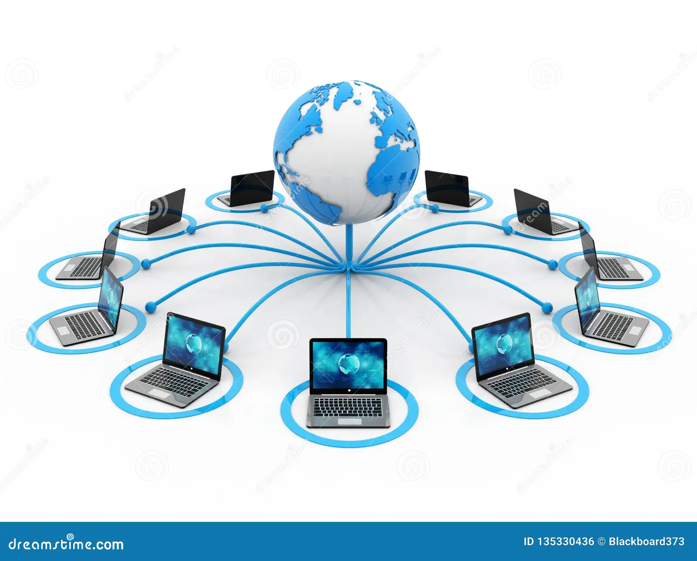
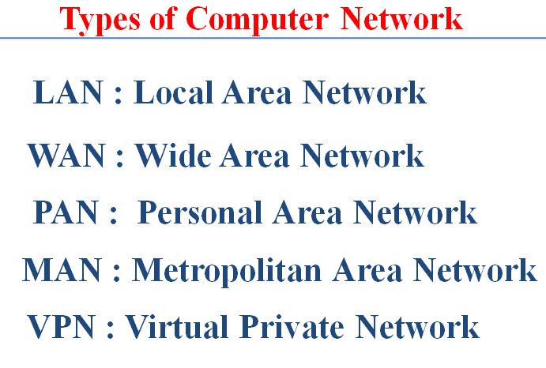

# Computer Networks

## Definition

A **Computer Network** is an interconnected system of two or more computing devices that communicate and share resources (data, applications, hardware, etc.) through wired or wireless transmission media.

A computer network enables **data exchange**, **resource sharing**, and **communication services** (such as email, file transfer, and VoIP) among users and devices.

- Allows seamless sharing of data, applications, and hardware (e.g., printers, storage).
- Supports real-time communication across long distances.
- Provides scalability, reliability, and fault tolerance.

Two fundamental characteristics are **scalability**, which allows easy addition of new devices or users, and **resource sharing**, which ensures efficient utilization of hardware and software resources.

---

## Internet vs Computer Network

**Internet**: The Internet is a global network of interconnected networks using the TCP/IP protocol to link devices worldwide.

**Computer Network**: A computer network can be as small as two computers connected locally or as large as the Internet itself.

| Aspect         | Computer Network                                | Internet                                               |
|----------------|-------------------------------------------------|--------------------------------------------------------|
| **Scope**      | May be local (LAN) or wide (WAN).               | Global network of networks.                            |
| **Ownership**  | Managed by an organization or individual.       | No single owner; consists of many independent networks. |
| **Protocols**  | Can use different protocols (Ethernet, etc.).   | Primarily relies on TCP/IP.                            |
| **Access**     | Private or public.                              | Public and universally accessible.                     |
| **Security**   | Controlled by the network owner.                | Requires multiple layers of security mechanisms.        |

---

## Types of Computer Networks

### 1. Local Area Network (LAN)
- Covers a small geographical area like a home, office, or campus.
- High data transfer rates; usually privately owned.
- **Example:** Office network with Ethernet or Wi-Fi.

### 2. Metropolitan Area Network (MAN)
- Spans a city or metropolitan region.
- Connects multiple LANs for efficient city-wide communication.
- **Example:** Cable TV networks.

### 3. Wide Area Network (WAN)
- Covers large geographical areas, even globally.
- Often uses public transmission systems like leased telephone lines or satellites.
- **Example:** The Internet.

### 4. Wireless Networks
- Uses radio signals, infrared, or satellites for communication.
- Includes Wi-Fi, cellular (4G/5G), and satellite networks.

### 5. Personal Area Network (PAN)
- Very small range (a few meters).
- Connects personal devices like smartphones, laptops, and wearables.
- **Example:** Bluetooth connections.

### 6. Virtual Private Network (VPN)
- Securely extends a private network across a public network.
- Uses encryption to ensure privacy and secure data transmission.

---

## Network Topologies

- **Bus:** Single backbone cable; simple but less fault tolerant.  
- **Star:** All nodes connect to a central hub; easy to manage.  
- **Ring:** Devices connected in a circular path; data travels in one direction.  
- **Mesh:** Every node connected to every other; high reliability.  
- **Hybrid:** Combination of two or more topologies.

---

## Network Devices

- **Router:** Forwards data packets between networks.
- **Switch:** Connects devices within a LAN and forwards data intelligently.
- **Hub:** Broadcasts data to all connected devices.
- **Access Point:** Provides wireless connectivity.
- **Gateway:** Connects networks using different protocols.

---

## Protocols and Models

- **OSI Model:** 7-layer conceptual model (Physical → Application).  
- **TCP/IP Model:** 4-layer practical model (Link → Application).  
- **Common Protocols:** HTTP/HTTPS, FTP, SMTP, DNS, DHCP, ARP.

---

## Advantages of Computer Networks

- **Resource Sharing:** Share hardware, software, and data.
- **Communication:** Email, instant messaging, and video conferencing.
- **Scalability:** Easy to add new devices and users.
- **Data Backup & Reliability:** Centralized storage and redundancy.

---

## Disadvantages of Computer Networks

- **Security Risks:** Vulnerable to hacking and malware.
- **Setup & Maintenance Cost:** Hardware, cabling, and skilled staff required.
- **Complexity:** Requires network design and administration.
- **Downtime Issues:** Network failures can disrupt operations.

---
