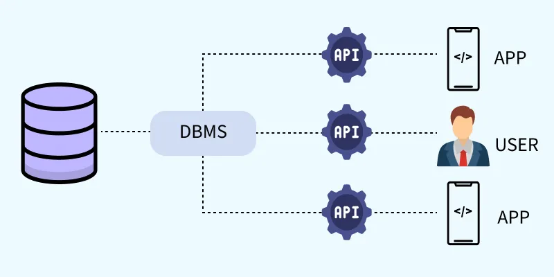
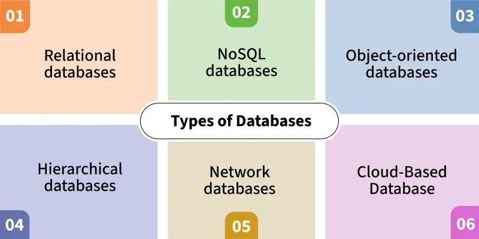

# Database Management System (DBMS)

## Definition

A **Database** is an organized collection of data, generally stored and accessed electronically.  

A **Database Management System (DBMS)** is a **software layer** that allows users and applications to store, modify, and retrieve data from databases efficiently and securely.

- It allows users to create, update, and query databases efficiently.
- Ensures data integrity, consistency, and security across multiple users and applications.
- Reduces data redundancy and inconsistency through centralized control.
- Supports concurrent data access, transaction management, and automatic backups 

Two important characteristics of DBMSs are **data independence**, which guarantees that modifications to data structures do not impact application layers, and **data abstraction**, which makes database interactions simpler by shielding users from the complexity of data storage.

---

## File Management System vs DBMS

**File System**: The file system is basically a way of arranging the files in a storage medium like a hard disk.

**DBMS**: Database Management System is basically software that manages the collection of related data.

| Aspect                    | File Management System                           | Database Management System                       |
|---------------------------|---------------------------------------------------|------------------------------------------------------------|
| **Data Storage**          | Data stored in individual files.                   | Data stored in structured databases (tables, schemas).     |
| **Redundancy**            | High; multiple copies of same data may exist.      | Low; normalization reduces redundancy.                     |
| **Data Consistency**      | Difficult to maintain across multiple files.        | Ensured by constraints and ACID properties.                |
| **Data Access**           | Requires complex code to read/update files.         | Simple queries using SQL or other query languages.         |
| **Concurrency Control**   | Minimal; risk of overwriting data.                  | Built-in mechanisms (locks, transactions) for safe access. |
| **Security**              | Limited or OS-dependent.                           | Fine-grained access control and authentication.            |
| **Backup & Recovery**     | Manual and error-prone.                             | Automated backup and recovery tools.                       |
| **Scalability**           | Difficult to scale for large data and users.         | Highly scalable for big data and multiple users.           |
| **Complexity**          | Simpler for small, single-user applications.        | More complex but powerful for multi-user environments.      |

---

## Types of DBMS

### 1. Relational Databases (RDBMS)

- It organizes data into tables (relations) composed of rows and columns.

- Uses primary keys to uniquely identify rows and foreign keys to establish relationships between tables.

- Uses **SQL** for querying, which allows efficient data manipulation and retrieval.  

- Examples: `MySQL`, `PostgreSQL`, `Oracle`.

### 2. NoSQL Databases

- Designed to handle large-scale data and provide high performance for scenarios where relational models might be restrictive.

- Non-tabular, supports key-value, document, column, or graph formats.  

- Enable rapid scaling and are well-suited for unstructured or semi-structured data.

- Examples: `MongoDB`, `Cassandra`, `Neo4j`.

### 3. Object-Oriented Databases

- Integrates object-oriented programming concepts into the database environment, allowing data to be stored as objects.

- Example: `db4o`, `ObjectDB`.

### 4. Hierarchical Databases

- Organizes data in a tree-like structure, where each record (node) has a single parent and have multiple children.

- This model is similar to a file system with folders and subfolders.

- Navigation is fast and predictable due to the fixed structure.

- Example: `IBM Information Management System` (IMS).

### 5. Network Databases

- It uses a graph-like model to allow more complex relationships between entities.

- Data is represented using records and sets, where sets define the relationships.

- Unlike the hierarchical model, it permits each child to have multiple parents, enabling many-to-many relationships.

- Example: `Integrated Data Store` (IDS).

### 6. Cloud-Based Database

- They are hosted on cloud computing platforms like AWS, Azure or Google Cloud.

- They offer on-demand scalability, high availability, automatic backups and remote accessibility.

- Example: `Amazon RDS` (for SQL), `MongoDB Atlas` (for NoSQL), `Google BigQuery`.

---

## Advantages of DBMS

- **Data Independence:** Changes in storage do not affect applications.

- **Efficient Data Access:** Optimized queries for fast retrieval.

- **Reduced Redundancy:** Normalization ensures minimal duplication.

- **Multi-User Support:** Controlled concurrent access.

- **Improved Security:** Role-based authentication and encryption.

---

## Disadvantages of DBMS

- **Cost:** Licensing and maintenance can be expensive.

- **Complexity:** Requires skilled professionals.

- **Performance Overhead:** Additional layers of abstraction may slow simple tasks.

---

