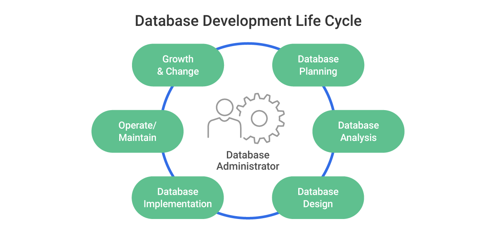

# Database Administrator (DBA)

## Definition

A **Database Administrator (DBA)** is a professional responsible for the **installation, configuration, maintenance, and security** of a database system.  
The DBA ensures that data is **available, consistent, secure, and recoverable** at all times. They also manage database performance, backup and recovery, and user access.

## Key Roles & Responsibilities of a DBA

- **Database Installation & Configuration**  
  Set up DBMS software, configure instances, and maintain database servers.

- **User Management & Security**  
  Create user accounts, assign roles, manage privileges, and implement encryption to protect data.

- **Performance Monitoring & Tuning**  
  Optimize queries, manage indexes, tune the database for high performance.

- **Backup & Recovery**  
  Schedule regular backups, test recovery strategies, and perform disaster recovery when required.

- **Data Integrity & Consistency**  
  Enforce constraints, triggers, and maintain ACID properties.

- **Upgrades & Patching**  
  Apply patches, migrate databases to new versions or hardware.

- **Storage & Capacity Planning**  
  Forecast future storage requirements and plan hardware or cloud resources.

- **Documentation & Automation**  
  Document configurations, automate repetitive tasks with scripts.

---

## Types of Database Administrators

DBAs can be categorized based on **specialization and responsibility** within the database ecosystem.

| **Type of DBA**       | **Primary Focus**                                                        | **Key Responsibilities**                                                                                              | **Examples / Context**                                      |
|-----------------------|---------------------------------------------------------------------------|------------------------------------------------------------------------------------------------------------------------|-------------------------------------------------------------|
| **System DBA**        | Database **infrastructure and system-level** operations.                 | Installs DBMS, manages OS-level tuning, configures hardware, applies patches, monitors system performance.              | Works closely with system administrators for hardware/OS.    |
| **Database Architect** | **Design and modeling** of database structure.                           | Designs schemas, data models, normalization, relationships, indexing strategy, long-term scalability planning.          | Works with developers during the design phase of projects.   |
| **Application DBA**   | **Supporting specific applications** that use the database.               | Works with developers, optimizes SQL queries, manages stored procedures, ensures database meets app requirements.       | Supports ERP, CRM, or any business-critical application.     |
| **Performance/ Tuning DBA** | Focuses on **query and performance optimization**.                   | Index management, analyzing query plans, monitoring bottlenecks, load balancing, caching strategies.                     | Large-scale e-commerce or analytics platforms.               |
| **Backup & Recovery DBA** | Dedicated to **disaster recovery and backup planning**.               | Implements backup strategies (full, incremental, differential), tests restore procedures, configures replication.        | Mission-critical financial or healthcare systems.            |
| **Security DBA**      | Ensures **data privacy and compliance** with regulations (e.g., GDPR).   | Manages access control, encryption, auditing, security patches, compliance reports.                                      | Enterprises handling sensitive or regulated data.            |
| **Cloud DBA**         | Manages **cloud-based** database services.                               | Configures and optimizes managed services (e.g., AWS RDS, Azure SQL, Google Cloud SQL), cost management, scaling.       | Modern SaaS platforms and hybrid cloud deployments.          |

---

## Skills Required for a DBA

- **Technical Skills**: SQL, DBMS internals, OS fundamentals, scripting (Python/Shell), backup tools.

- **Analytical Skills**: Troubleshooting performance, diagnosing failures.

- **Security Awareness**: Data encryption, role-based access, compliance standards.

- **Communication**: Collaborate with developers, system admins, and management.

---