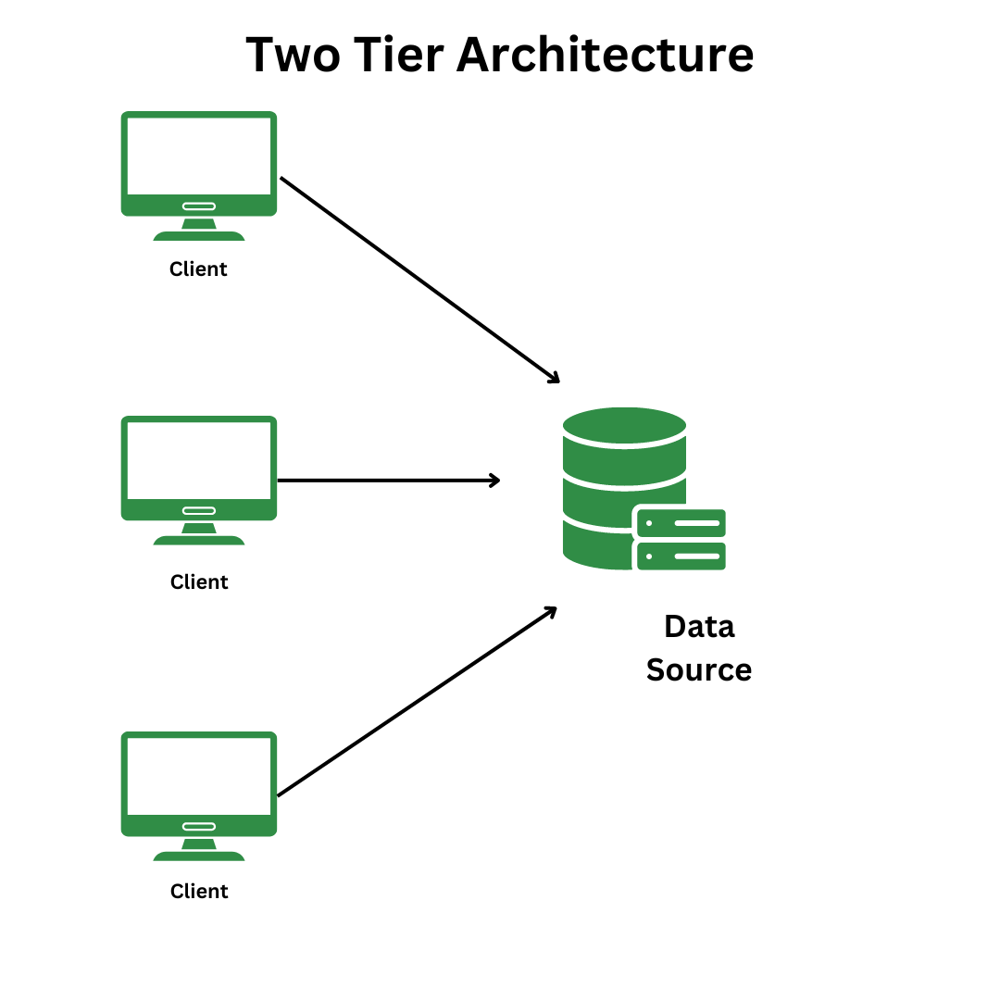
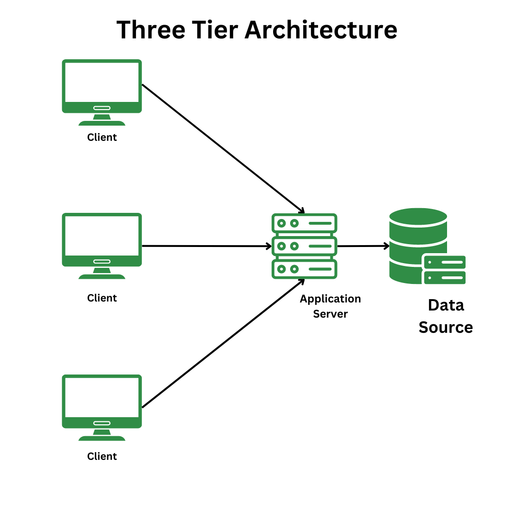

# DBMS Architecture

## Definition

A **Database Architecture** defines how the database, application logic, and user interface layers are organized.  
The most common architectures are **Two-Tier** and **Three-Tier**, differing mainly in how the **application logic** is separated from the user interface and database.

---

## Two-Tier Architecture

- **Structure**:  

  - **Tier 1 (Client):** User interface and application logic.  

  - **Tier 2 (Database Server):** Database system (DBMS) storing and processing data.

- **How It Works**:  
  The client directly communicates with the database server using APIs (ODBC/JDBC).  
  The client handles **UI + business logic**, while the server manages data storage and query execution.

- **Examples**:  
  
  - Simple client-server applications.  
  
  - Standalone desktop apps (e.g., small inventory management systems).  

- **Advantages**:
  
  - Faster communication (fewer layers).  
  
  - Easier to develop for small-scale applications.

- **Disadvantages**:
  
  - Tight coupling of UI and business logic.  
  
  - Harder to scale; adding more users increases server load.  
  
  - Limited security because clients access the database directly.

---

## Three-Tier Architecture

- **Structure**:  
  
  - **Tier 1 (Presentation Layer):** User interface (web browser, mobile app, GUI).  
  
  - **Tier 2 (Application Layer):** Application server/business logic (API, middleware).  
  
  - **Tier 3 (Database Layer):** Database server (DBMS).

- **How It Works**:  
  The client interacts with the **application server**, which processes business logic and communicates with the database.  
  The database never communicates directly with the client.

- **Examples**:
  
  - Web applications (e-commerce, banking).  
  
  - Enterprise applications using middleware like **Spring Boot**, **Django**, **.NET**.

- **Advantages**:
  
  - Better scalability and load distribution.  
  
  - Stronger security (database is hidden behind the application layer).  
  
  - Easier maintenance—business logic changes do not affect the UI or database directly.

- **Disadvantages**:
  
  - Slightly higher complexity.  
  
  - Increased network latency due to an extra layer.

---

## Tabular Comparison

| **Aspect**              | **Two-Tier Architecture**                                          | **Three-Tier Architecture**                                       |
|-------------------------|--------------------------------------------------------------------|--------------------------------------------------------------------|
| **Layers**              | Client + Database                                                 | Presentation + Application + Database                             |
| **Business Logic**      | Implemented on the client side.                                    | Handled by the application/middleware layer.                       |
| **Client-DB Connection**| Direct connection to the database using drivers (ODBC/JDBC).       | Client interacts only with the application server, not DB directly. |
| **Security**            | Less secure; clients access the DB directly.                       | More secure; DB hidden behind middleware.                          |
| **Scalability**         | Limited; adding clients increases DB load.                          | Highly scalable; application servers can be load-balanced.          |
| **Maintenance**         | Harder; UI and business logic tightly coupled.                     | Easier; UI, logic, and DB are independent.                         |
| **Performance**         | Faster for small user bases (direct communication).                | Slight overhead due to extra layer but better for large systems.    |
| **Use Cases**           | Small desktop apps, LAN-based systems.                             | Web apps, enterprise systems, cloud-based applications.             |

---