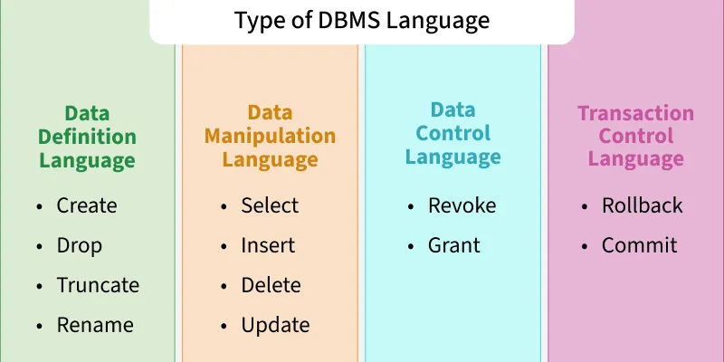

# Database Languages

## Definition

Database languages are specialized languages used to **define, manipulate, and control** data in a Database Management System (DBMS).  
They provide a standard way to **create database structures**, **query and modify data**, and **control access and transactions**.

## 1. Data Definition Language (DDL)

- **Purpose**: Defines the **structure** of the database, such as creating, altering, or dropping tables and schemas.  

- **Characteristics**:
  - Deals with **schema** and database objects.
  
  - Auto-committed (changes are permanent).

- **Common Commands**:
  | Command       | Description                                                      |
  |---------------|------------------------------------------------------------------|
  | **CREATE**    | Create new database objects (tables, views, indexes, schemas).   |
  | **ALTER**     | Modify the structure of an existing object (add/drop columns).   |
  | **DROP**      | Delete objects permanently from the database.                    |
  | **TRUNCATE**  | Remove all records from a table but keep its structure.          |
  | **RENAME**    | Rename a database object.                                        |

---

## 2. Data Manipulation Language (DML)

- **Purpose**: Used to manipulate and modify data stored in database tables.

- **Types**:

    - **Procedural DML**: Specifies what data is needed and how to get it.

    - **Non-Procedural DML (Declarative)**: Specifies what data is needed, not how.

- **Common Commands**:
    | Command    | Description                                   |
    | ---------- | --------------------------------------------- |
    | **INSERT** | Add new rows of data into a table.            |
    | **UPDATE** | Modify existing records.                      |
    | **DELETE** | Remove rows from a table.                     |
    | **MERGE**  | Insert or update data conditionally (UPSERT). |

---

## 3. Data Query Language (DQL)

- **Purpose**: Primarily used to retrieve data from the database.

- **Main Command**:
    | Command    | Description                               |
    | ---------- | ----------------------------------------- |
    | **SELECT** | Fetch data from one or more tables/views. |
    | **FROM**   | Specify the table(s) to query data from.  |
    | **WHERE**  | Filter records based on conditions.        |
    | **GROUP BY** | Aggregate data based on one or more columns.|
    | **HAVING** | Filter aggregated data.                    |
    | **ORDER BY** | Sort the result set.                       |

- **Note**: Some classifications treat DQL as a subset of DML, but it is often listed separately because it focuses only on querying data.
---

## 4. Data Control Language (DCL)

- **Purpose**: Controls access privileges and permissions to database objects.

- **Common Commands**:
    | Command       | Description                                                      |
    |---------------|------------------------------------------------------------------|
    | **GRANT**     | Provide specific user permissions (SELECT, INSERT, UPDATE).      |
    | **REVOKE** | Remove previously granted permissions.                      |

---

## 5. Transaction Control Language (TCL)

- **Purpose**: Manages transactions in a database to ensure ACID properties (Atomicity, Consistency, Isolation, Durability).

- **Common Commands**:
    | Command             | Description                                                   |
    | ------------------- | ------------------------------------------------------------- |
    | **COMMIT**          | Permanently save all changes made in the current transaction. |
    | **ROLLBACK**        | Undo changes since the last COMMIT or SAVEPOINT.              |
    | **SAVEPOINT**       | Set a point within a transaction to roll back partially.      |
    | **SET TRANSACTION** | Configure properties of a transaction.                        |

---

## Key Notes

- DDL commands are auto-committed (changes are permanent immediately).

- DML changes can be rolled back until a COMMIT.

- TCL ensures transactions are atomic and consistent.

- DCL is essential for database security and access control.