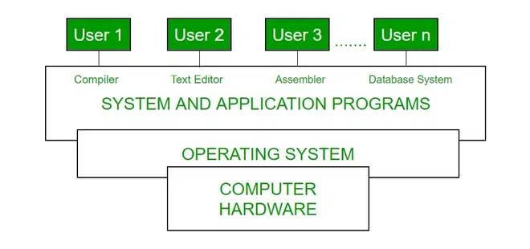

# Operating Systems

## Definition

An **Operating System (OS)** is **system software** that acts as an **intermediary between computer hardware and the user**.  

- It manages hardware resources, provides essential services for applications, and ensures that different programs and users can run efficiently and securely on the same machine.

- Manages the overall resources and operations of the computer. 

- Examples of Operating Systems are `Windows`, `Linux`, `macOS`, `Android`, `iOS`, etc.

---

## Key Functions of an Operating System

| Function                  | Description                                                                 |
|---------------------------|-----------------------------------------------------------------------------|
| **Process Management**    | Creates, schedules, and terminates processes; handles multitasking.          |
| **Memory Management**     | Allocates and deallocates RAM; manages virtual memory and paging.            |
| **File System Management**| Organizes and provides access to files and directories on storage devices.   |
| **Device Management**     | Manages communication with hardware devices using device drivers.            |
| **I/O Management**        | Handles input/output operations and buffering between hardware and software. |
| **Security & Protection** | Implements authentication, permissions, and encryption to protect resources. |
| **User Interface**        | Provides CLI (Command Line Interface) or GUI (Graphical User Interface).    |
| **Networking**            | Supports data exchange over networks, protocols, and internet connectivity.  |
| **Error Detection**       | Monitors the system for errors and takes corrective actions.                 |

---

## Operating System Components

1. **Kernel**  
   - The core of the OS; manages CPU, memory, and device operations.  
   - Types: Monolithic Kernel, Microkernel, Hybrid Kernel.

2. **Shell**  
   - Interface between user and kernel.  
   - CLI (e.g., Bash) or GUI (e.g., Windows Explorer).

3. **File System**  
   - Responsible for organizing and storing data on disks.

4. **Device Drivers**  
   - Software modules that enable the OS to communicate with hardware.

5. **System Utilities**  
   - Tools for system monitoring, file management, and configuration.

---

## Types of Operating Systems

| Type                        | Description                                                                 | Examples                          |
|-----------------------------|-----------------------------------------------------------------------------|------------------------------------|
| **Batch OS**                | Executes batches of jobs without user interaction.                           | IBM OS/360                         |
| **Multi-Programming OS**    | Allows multiple programs to run simultaneously by sharing CPU time.           | UNIX, Linux                         |
| **Multi-Tasking/Time-Sharing** | Supports multiple users/programs interacting at once.                      | Windows, macOS, Linux              |
| **Real-Time OS (RTOS)**     | Processes data and responds instantly (deterministic).                        | VxWorks, QNX, RTLinux               |
| **Distributed OS**          | Runs on a group of networked computers and appears as a single system.        | Amoeba, Plan 9                      |
| **Network OS**              | Provides services to computers connected over a network.                      | Novell NetWare, Windows Server      |
| **Mobile OS**               | Designed for mobile devices with touch support and power optimization.        | Android, iOS                        |
| **Embedded OS**             | Built for embedded systems with limited resources.                            | Embedded Linux, FreeRTOS            |

---

## Key Characteristics of an OS

- **Multi-User**: Supports multiple users simultaneously.

- **Multi-Tasking**: Runs multiple applications at the same time.

- **Portability**: Can be adapted to different 
hardware platforms.

- **Security**: Protects data and resources from unauthorized access.

- **Concurrency**: Handles multiple operations in parallel.

---