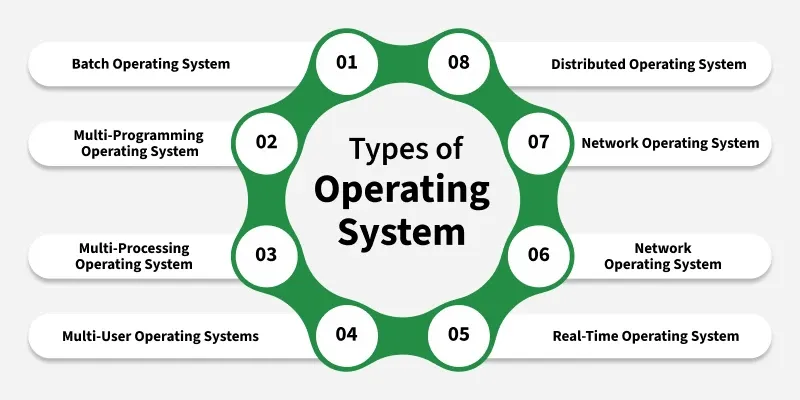

# Types of Operating Systems

An **Operating System (OS)** manages computer hardware and software resources and provides services for computer programs.  
Different systems have different requirements, so operating systems are classified into various types based on their functionality and usage.

---

## 1. Batch Operating System

- **Definition:** Executes batches of jobs automatically without direct user interaction.

- **How it Works:** Users prepare jobs offline → Jobs are collected → OS executes them sequentially.

- **Advantages:** Good for large repetitive tasks; efficient CPU use.

- **Disadvantages:** No real-time user interaction; debugging is difficult.

- **Examples:** IBM OS/360, early UNIX.

---

## 2. Multi-Programming Operating System

- **Definition:** Allows multiple programs to reside in memory and share CPU time.

- **How it Works:** The CPU switches between jobs when one is waiting for I/O.

- **Advantages:** Maximizes CPU utilization.

- **Examples:** UNIX, Linux.

---

## 3. Multi-Tasking / Time-Sharing Operating System

- **Definition:** Enables multiple tasks or users to work interactively at the same time.

- **How it Works:** CPU time is divided into small time slices for each process.

- **Advantages:** Responsive to users; supports many users simultaneously.

- **Examples:** Windows, macOS, Linux.

---

## 4. Real-Time Operating System (RTOS)

- **Definition:** Processes data and responds within a guaranteed time frame.

- **Types:**
  - **Hard RTOS:** Deadlines must be met (e.g., aerospace control).
  - **Soft RTOS:** Occasional delays tolerated (e.g., multimedia systems).

- **Examples:** VxWorks, QNX, RTLinux.

---

## 5. Distributed Operating System

- **Definition:** Runs on a group of networked computers and appears as a single system.

- **Advantages:** Resource sharing, fault tolerance.

- **Examples:** Amoeba, Plan 9, LOCUS.

---

## 6. Network Operating System (NOS)

- **Definition:** Provides services to computers connected over a network.

- **Features:** File sharing, printer sharing, user management.

- **Examples:** Novell NetWare, Windows Server, UNIX/Linux server editions.

---

## 7. Mobile Operating System

- **Definition:** Designed for smartphones, tablets, and other handheld devices.

- **Features:** Touch interface, power optimization, app ecosystems.

- **Examples:** Android, iOS, Windows Phone.

---

## 8. Embedded Operating System

- **Definition:** Built for specialized devices with limited hardware resources.

- **Usage:** IoT devices, home appliances, medical equipment.

- **Examples:** Embedded Linux, FreeRTOS, Windows IoT.

---

## 9. Single-User, Single-Tasking OS

- **Definition:** One user can run only one task at a time.

- **Examples:** MS-DOS, early Palm OS.

---

## 10. Single-User, Multi-Tasking OS

- **Definition:** One user can run multiple applications simultaneously.

- **Examples:** Modern Windows, macOS.

---

## Comparison Table

| Type                    | Multi-User | Real-Time | Example OS           |
|-------------------------|-----------|----------|----------------------|
| **Batch**                  | No        | No       | IBM OS/360           |
| **Multi-Programming**      | No        | No       | UNIX, Linux          |
| **Time-Sharing**           | Yes       | No       | Windows, macOS       |
| **Real-Time**             | Sometimes | Yes      | VxWorks, QNX         |
| **Distributed**           | Yes       | Varies   | Amoeba, Plan 9       |
| **Network**               | Yes       | No       | Windows Server       |
| **Mobile**                | Yes       | Sometimes| Android, iOS         |
| **Embedded**              | No        | Often    | FreeRTOS, Embedded Linux |

---

## Summary

- **Batch OS** → Executes jobs in groups without interaction.  

- **Multi-Programming/Tasking** → Runs several processes at once.  

- **Real-Time OS** → Guarantees immediate response.  

- **Distributed OS** → Uses multiple machines as one system.  

- **Network OS** → Manages resources across a network.  

- **Mobile & Embedded OS** → Specialized for portable and dedicated devices.

These types are often combined in modern systems (e.g., Android is multi-tasking, network-enabled, and mobile).
